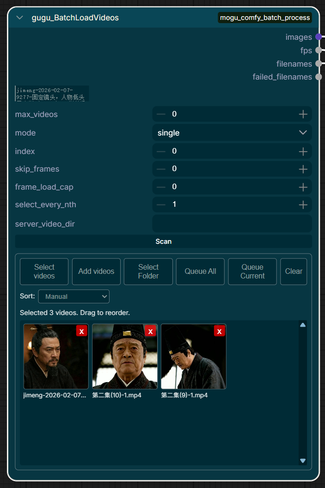

# mogu_comfy_batch_process



ComfyUI 自定义节点集合，提供批量图片/视频加载、媒体列表管理与失败项回收功能。

## 项目来源声明

本项目基于原项目 **ComfyUI-IAI666-BatchLoadImages** 修改而来：  
https://github.com/ophisqq/ComfyUI-IAI666-BatchLoadImages

在原有批量图片加载能力的基础上，本项目扩展并重构了多项功能，重点增强了视频工作流与批处理稳定性。

## 新增与增强功能

- 视频批处理：新增 `gugu_BatchLoadVideos` 节点，支持批量读取视频并解码帧。
- 错误检测：节点输出 `failed_filenames`，前端可查看失败列表并进行重试（Re-queue）或清空。
- 列表排序：支持手动拖拽排序、按名称排序（升/降序）、按修改时间排序（新旧序）。
- 视频目录扫描：支持按 `server_video_dir` 扫描服务器目录并批量加入列表。

## 快速使用说明

1. 安装并重启 ComfyUI  
   将本项目放入 `ComfyUI/custom_nodes`，执行 `pip install -r requirements.txt`，然后重启 ComfyUI。

2. 图片批处理（`GuguBatchLoadImages`）  
   将图片路径按行填入 `image_list`，`mode=batch` 可批量加载，`mode=single + index` 可按序号单张加载。

3. 视频批处理（`gugu_BatchLoadVideos`）  
   可手动填写 `video_list`，或设置 `server_video_dir` 后点击 `Scan` 自动加入列表；再通过 `skip_frames`、`select_every_nth`、`frame_load_cap` 控制抽帧数量。

4. 失败项处理与排序  
   执行后查看 `failed_filenames` 或前端失败面板，使用 `Re-queue` 重试失败项；列表可拖拽手动排序，也可按名称/时间自动排序。

## 节点说明

### 1) GuguBatchLoadImages

- 输入：`image_list`, `max_images`, `mode(batch/single)`, `index`
- 输出：`images`, `filenames`, `failed_filenames`
- 功能：批量/单张加载图片，自动过滤无效路径并记录失败项

### 2) gugu_BatchLoadVideos

- 输入：`video_list`, `max_videos`, `mode`, `index`, `skip_frames`, `frame_load_cap`, `select_every_nth`, `server_video_dir`
- 输出：`images`, `fps`, `filenames`, `failed_filenames`
- 功能：批量解码视频帧，支持跳帧、采样、限制最大帧数与目录扫描


## 安装方式

```bash
cd ComfyUI/custom_nodes
git clone <your-repo-url> mogu_comfy_batch_process
cd mogu_comfy_batch_process
pip install -r requirements.txt
```

依赖说明：

- 视频解码依赖 `av`（已在 `requirements.txt` 中声明）
- `torch/numpy/Pillow` 通常由 ComfyUI 运行环境提供

## 使用建议

- 图片批处理：将文件名按行填入 `image_list`，可配合 `mode=single + index` 精确选择。
- 视频批处理：优先通过 `Scan` 按钮扫描目录，再用 `skip_frames/select_every_nth` 控制采样密度。
- 失败重试：执行后若有失败项，可在节点面板中 `Re-queue` 回队列重试。
- 列表管理：先手动拖拽整理，再按名称/时间排序做批量规范化处理。

## 目录结构

```text
mogu_comfy_batch_process/
|- core/        # 列表处理、路径解析、哈希工具
|- services/    # 图片/视频解码、目录扫描、预览代理等服务
|- nodes/       # ComfyUI 节点定义与注册
|- web/         # 前端扩展（媒体浏览、排序、失败面板等）
|- server_routes.py
|- __init__.py
```

## 致谢

- 原项目作者与贡献者：`ophisqq/ComfyUI-IAI666-BatchLoadImages`
